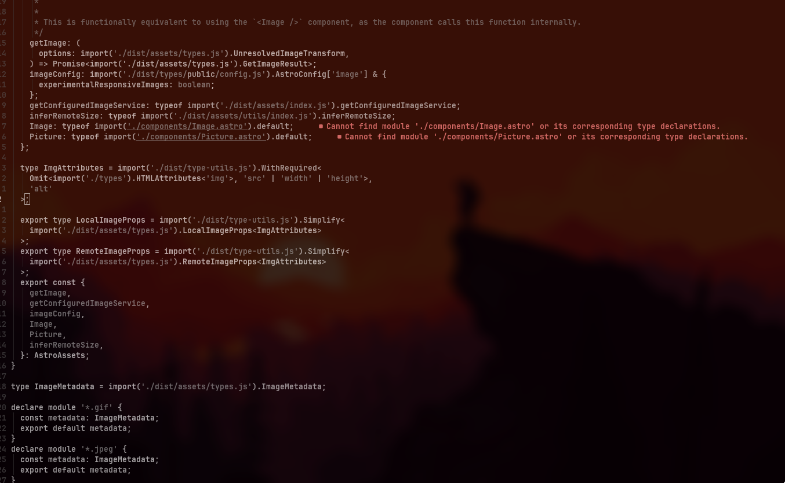
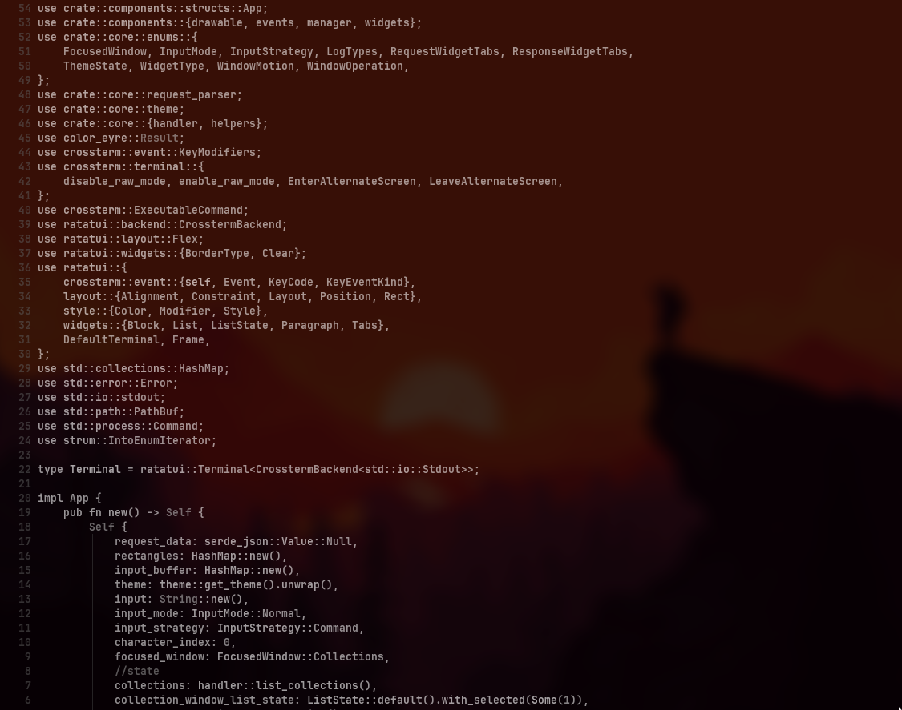

I prefer to use neovim over vscode for editing text on a daily basis. Editing on neovim feels more comfortable than using any other code editor or IDE. Once you get used to telescope there is no going back, `<leader>ff`, you got a file picker, `<leader>fa` now you can see all the files including dotfiles. `<leader>fw` now you can fuzzy search file content, and it is fast.

This article is not about how convient it is to edit text on neovim. This is about why i choose NvChad over trying to do the configuration by myself entirely.

I find myself as a minimalist but look and feel matters. I prefer `base46` but i only use the monochrome theme :).

yeah, that's what i like, all white and gray. `trouble.nvim` add some colors here and there, but most of it is monochrome. I find it difficult to look at code with rainbow colors. So most probably i might stick to this.

